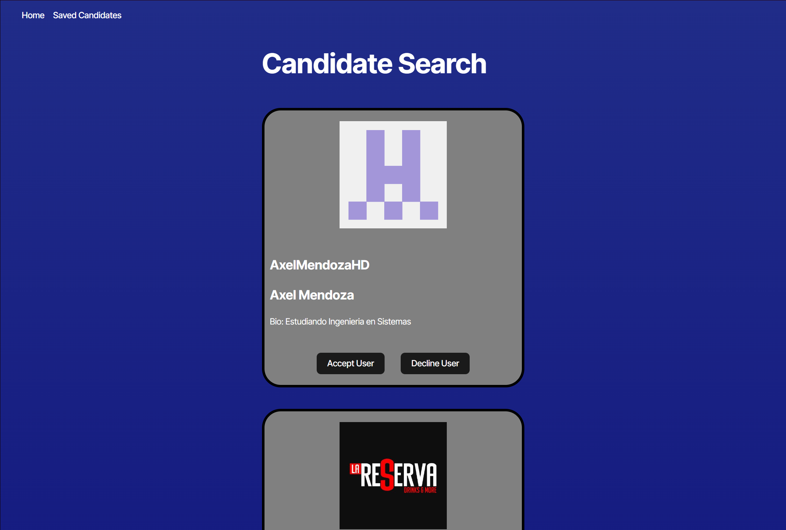
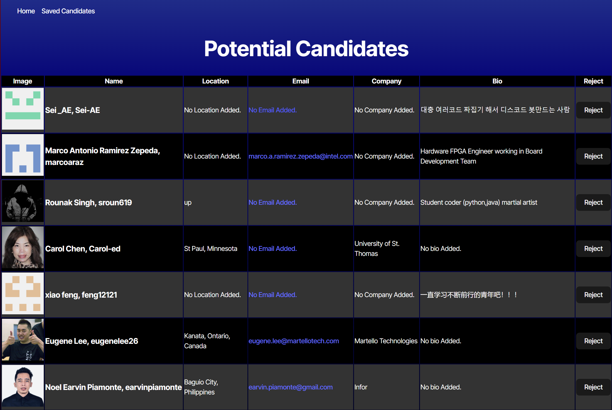

# Challenge-13 (Canidate Search)

## Introduction

[](https://opensource.org/licenses/MIT)
[](https://github.com/ellerbrock/typescript-badges/)

This app lets you view a list of github users.

Use <a href=https://challenge-13-candidate-search.onrender.com/>this</a> link to go to the deployed site!

## Table of Contents

- [Required-Technologies](#required-technologies)
- [Installation](#installation)
- [Usage](#usage)
- [Code Snippet](#code-snippet)
- [Screenshots](#screenshots)
- [Features](#features)
- [Future-Features](#future-features)
- [License](#license)
- [Technologies](#technologies-used)
- [Credits](#credits)
- [Contact Me](#contact-me)

## Required Technologies

This project requires node.js and its included node package manager.\
You can go to <a href="https://nodejs.org/en/download/package-manager">this</a> website to download node.js and npm. Just follow node's included download instructions!

## Installation

Once the files are downloaded onto your machine open the project folder and run the terminal in the /develop directory.\
To install the necessary dependencies run the "npm i" command to install the required files.

Next go to the .env.EXAMPLE file within the develop/enviroment directiory and add a gitHub Fine-grained personal access token. Once thats been added, rename the file to just ".env". Finally, run "npm run dev" to run the Canidate Search site.

## Usage

Once started you'll be greeted by the Candidate Search Homepage. If your github token is present you will be greeted by a list of users. Each user card Has a profile picture, a username, and a Accept and Decline button. If a user has given a bio, name, email, location, and company, the corresponding information will also be displayed. Clicking on a users Accept button will send that users information to your local storage and remove that users information from the page. Declining a user will remove their information from the page.

All accepted users can be viewed on the Saved Candidates page (which can be accessed by clicking the Saved Candidates link at the top of the page). You can view each accepted users provided information. If a user provided no information for a specific tab, the tab will have a message letting the user know that no information was provided. Each accepted user can be declined with the decline button at the end of a users card. Declining a user will remove them from the page and remove their information from local storage.

On the main page there is also a "Clear Local Storage" button located at the bottom of the page. This is for clearing all candidates saved within local storage quickly. This button was mainly used for development purposes but was left in for users to clear storage quickly.

## Code Snippet

This code runs on page startup. It is what fills the page with user information. Because the github api does not give all information when asking for a list of users a seperate Api call has to be made by using a users Username to recieve additional information like bio, email, company, location, ect.

```
useEffect(() => {
    //first search through the github data. This returns back an array of users with incomplete information
    searchGithub().then( async (userData) => {

      //Map out the data from the github search so that each user can have informaition added to them
      const detailedUserPromises = userData.map((user: Candidate) =>
        //use the login provided by each user to grab additional information
        searchGithubUser(user.login).then((userDetails) => ({
          //spread out the original user data, then spread out the new user data
          ...user,
          ...userDetails
        }))
      );

      //Promise all takes all the individual promises from detailedUserPromises and removes all promise information. Returning back just the objects
      const detailedUsers = await Promise.all(detailedUserPromises);
      //We then send the parsed information to the updateUser function to have the page be updated
      updateUser(detailedUsers);
    });
  }, []);
```

## Screenshots

This is what the Candidate Search home page looks like.



This is what the Potential Candidate page looks like. Accepted Users data is stored here.



## Features

Features include:

- The ability to view multiple users
- A accept and decline button for adding and removing users
- A Saved Candidiates page for viewing all accepted users
- A clear storage button for removing all saved data quickly

## Future Features

Features that may be implemented in the future include:

- Filters for only seeing users with complete information
- A clearer style for User Experience improvement

## License

Licensed under the MIT license.

## Technologies Used

<ul>
<li>Node.js (for installing packages as well as building and running code).</li>
<li>Vite (for running a local server, and development).</li>
<li>Visual Studio Code (for writing code).</li>
<li>Mozila Web Docs and W3 Schools (for getting help with JavaScript).</li>
</ul>

## Credits

<ul>
<li>Joshua Pruitt (me)</li>
<li>Coding bootcamp staff (for their help with Coding)</li>
<ul>

## Contact Me

<ul>
<li>My email: joshuapruitt6484@gmail.com</li>
<li><a href=https://github.com/JoshuaPruitt>My GitHub</a></li>
<li><a href=https://www.linkedin.com/in/joshua-pruitt-1a494a311>My LinkedIn</a></li>
</ul>
